# cocoapods 总结与模块化实践
## cocoapods 解决的痛点
1. 导入包时复杂的步骤
2. 包与包之间的依赖
3. 协同开发时, 包版本的控制
4. 代码的分享和重复利用


## 刀耕火种

一个优秀的码农的必备品质是 "知其然, 知其所以然", 要熟练掌握 cocoapods ,我们需要了解 cocoapods 帮我们做了哪些工作, 下面我们用手动步骤模拟一下 cocoapods 的工作

### round one - 项目 A 依赖项目 B 的 .a

1. 建两个工程 HSKShellProject (后续用 Shell 指代), HSKLibProject(后续用 Lib 指代)
2. Shell 是我们的主工程文件, Lib 是 .a 工程
3. 在 Lib 中写一些代码, 然后编译出 .a, 注意要暴露出来公共头文件
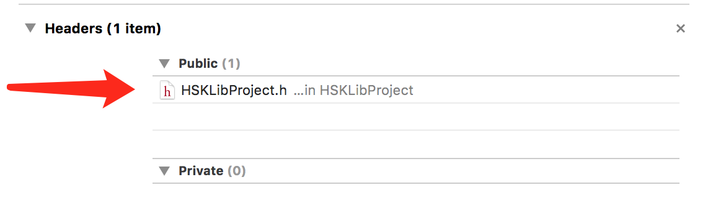
4. 进入 Shell, 我们要引用刚才编译的 .a 来使用, 有两个问题, Shell 如何找到 Lib.a, 编译的时候如何把 Lib.a 也打包进 Shell 呢
5. 答案在 <strong>Build Setting -> Library Search Paths, Header Search Paths, Other Link Flags</strong>


6. <strong>Library Search Paths</strong>, 顾名思义就是查找静态库的路径, 这里分享两个全局变量:<strong> $(PROJECT_DIR)</strong>, 指的是项目的根目录, <strong>$(SRC_ROOT)</strong>指的是源码的目录
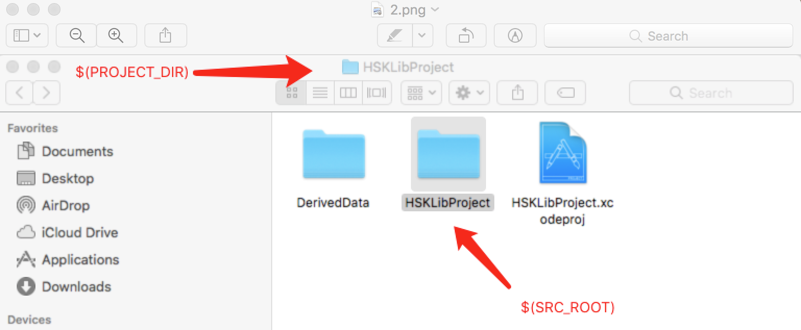 <br>
我们在这里填入 <strong>$(PROJECT_DIR)/../HSKLibProject/DerivedData/HSKLibProject/Build/Products/Debug-iphonesimulator/</strong>
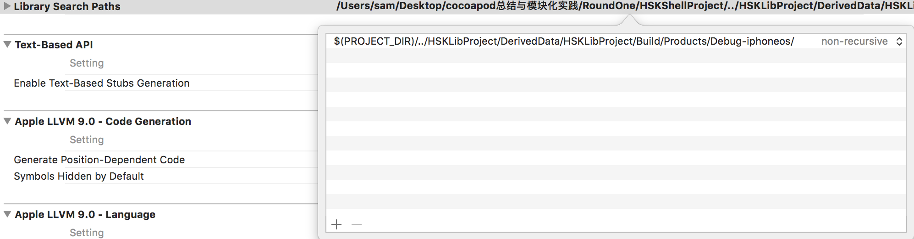


7. <strong>Header Search Paths</strong>, 顾名思义就是查找头文件的目录, 我们在这里填入 <strong>$(PROJECT_DIR)/../HSKLibProject/DerivedData/HSKLibProject/Build/Products/Debug-iphonesimulator/usr/local/include</strong>
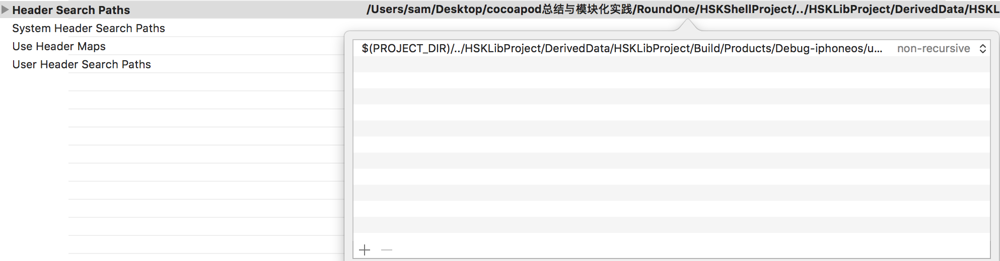


8. 这个时候我们就可以在 Shell 中引入 Lib 了, 但是如果编译 Shell 会报错 
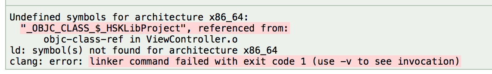
这是因为我们只是知道了 Lib 的引用路径, 但是在编译的时候并没有把 .a 链接进去, 这时候就需要 Other Link flags 啦

9. <strong>Other Link flags</strong>, 就是在链接的时候需要额外添加的参数, 如果要链接 .a, 这么写: <strong>-l xxx  </strong>, 如果需要链接 .framework, 这么写: <strong> -framework xxx </strong>, 在这里, 我们填入: <strong>-l HSKLibProject</strong>

10. 编译之后会发现错误消失了, 运行 Shell, 控制台也成功输出了, 到这里回顾一下我们所做的步骤, 我们在没有显示引入的情况下, 通过添加一些参数, 让一个工程依赖另一个工程的文件成功运行. 虽然有些简单, 跟 cocoapods 的效果还有很大的差距, 千里之行, 始于足下, 我们下面会讨论更复杂的情况

### RoundTwo 项目 A 依赖项目 B 的 .framework
1. .a 的局限性在于不能包含资源文件, 不利于模块化, 我们这里尝试 Shell 对 Lib 中 .framework 的依赖
2. .framework 的导入三个个地方需要设置: <strong>Header Search Paths, Framework Search Paths, Embedded Binaries</strong>


3. <strong>Header Search Paths</strong> 这里我们照例填入 Lib 的头文件地址 <strong>$(PROJECT_DIR)/../HSKLibProject/DerivedData/HSKLibProject/Build/Products/Debug-iphonesimulator/HSKLibProject.framework/Headers</strong>
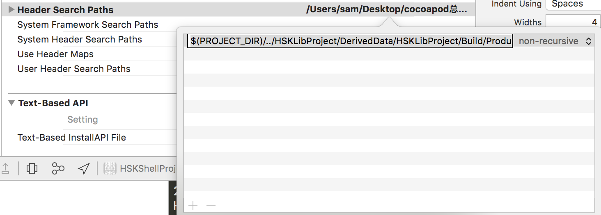

4. <strong>Framework Search Paths</strong> 这里我们照例填入 Lib 的头文件地址 <strong>$(PROJECT_DIR)/../HSKLibProject/DerivedData/HSKLibProject/Build/Products/Debug-iphonesimulator</strong>
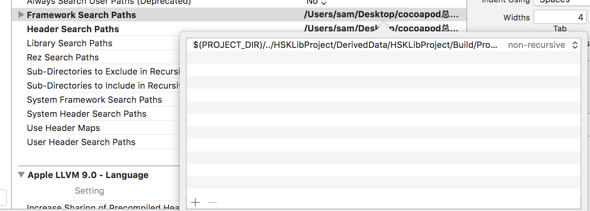

4. <strong>Embedded Binaries</strong> 设置如下图所示, 找到 HSKLibProject.framework

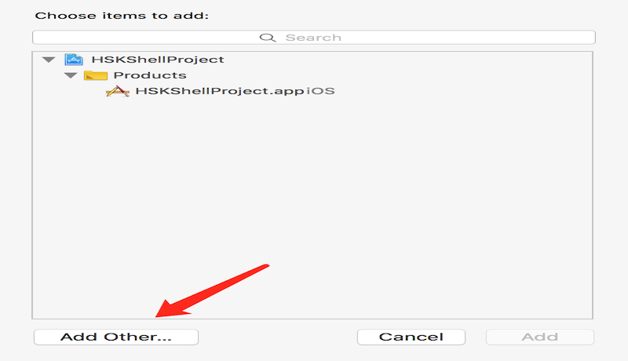
5. 在 <strong>Embedded Binaries</strong> 中添加好了之后会发现, 下面 <strong> Linked Framework and Libraries</strong> 也自动添加了 Lib

6. 经过测试引入 .a 库的时候 <strong>Linked Framework and Libraries</strong> 与 <strong>Other Link Flags</strong>效果一致, 到了导入 .framework 时情况有所不同: .framework 的导入必须使用 <strong>Embedded Binaries</strong> + <strong>Linked Framework and Libraries</strong> 组合, <strong>Linked Framework and Libraries</strong> + <strong>Other Link Flags</strong> 不行

7. 导入 .framework 的时候我们发现, 不管导入的时候有没有 copy, Shell 工程下总是会出现 .framework, 尽管是个引用, 但是我们观察 cocoapods 建立的工程, 只有一个 .framework 引用, 这是如何做到的, 我们接着尝试

### RoundThree 项目 A 依赖多个 .framework
1. 当然我们可以像上面那样一个个手动的添加一遍, 但是有个很大的弊端: 假如某个 .framework 代码修改了, 编译 Shell 的时候并不会去编译 Lib, 导致 Shell 里面还是老代码, 会给开发造成很大的困扰, 本来就掉头发, 再来点烦心事儿, 这日子没法过了!!

2. 这时候就需要 workspace 出马了, 在 workspace 是更大粒度的工程, 把 project 集成在 workspace 下, 相当于在一个工程内集成, 因此选择某个 target 编译的时候会先编译依赖, 就解决了上面的问题

3. 一步一步来, 我们在 Lib 下新建两个 target: HSKLibTwoProject, HSKLibPodProject(以后简称 Two, Pod), 这里比较难描述, 看图吧
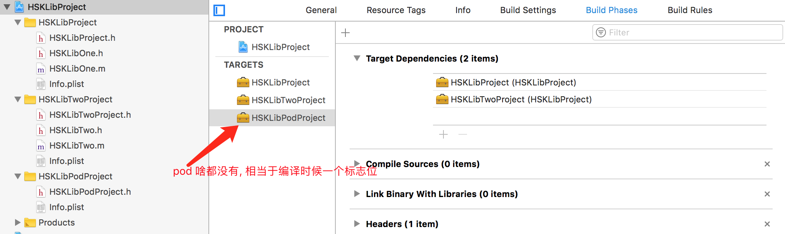

4. 如上图所示, 在 pod <strong>Build Phases -> Target Dependencies</strong> 中添加
HSKLibPorject.framework, HSKLibTwoProject.framework, 这里决定了编译顺序,

5. 然后设置 Shell 这边, 在 <strong>Linked Framework and Libraries</strong> 这里加入 Pod
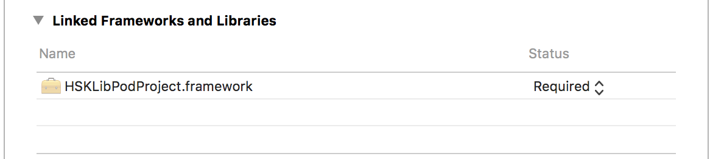

6. 接下来还是老套路, <strong>Header Search Paths</strong> 和 <strong>Framework Search Paths</strong>, 这里有一点要注意, 当工程加入 workspace 后, $(PROJECT_DIR) 就变成 workspace 所在的目录
7. <strong>Framework Search Paths</strong>中填入 <strong>$(PROJECT_DIR)/../DerivedData/HSKPod/Build/Products/Debug-iphonesimulator</strong>,
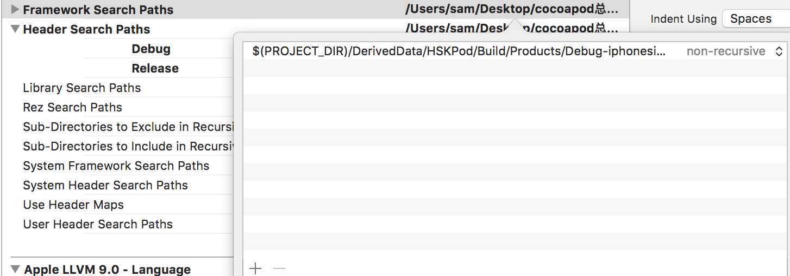


8. <strong>Header Search Paths</strong> 中填入 ~~<strong>$(PROJECT_DIR)/../DerivedData/HSKPod/Build/Products/Debug-iphonesimulator/**/Headers/<strong>~~ (之前 xcode 支持通配符展开, 更新之后不支持了, 很无奈)
 <strong>$(PROJECT_DIR)/../DerivedData/HSKPod/Build/Products/Debug-iphonesimulator/HSKLibProject/Headers/<strong> 和
 <strong>$(PROJECT_DIR)/../DerivedData/HSKPod/Build/Products/Debug-iphonesimulator/HSKLibTwoProject/Headers/<strong>
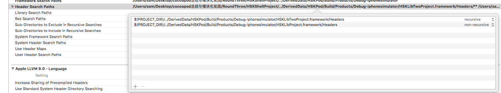

9. 在 Shell <strong>Linked Framework and Libraries</strong> 中添加 Pod, 这一步是为了设置依赖关系, 让 Shell 编译的时候知道先去编译 Pod
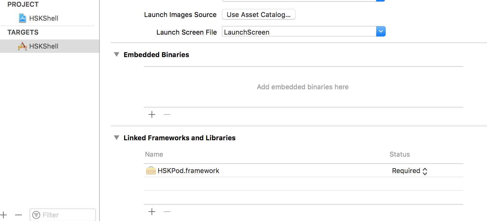

10. 最后在 <strong>Other Link Flags</strong> 那里添加: -framework HSKLibProject, -framework HSKLibTwoProject
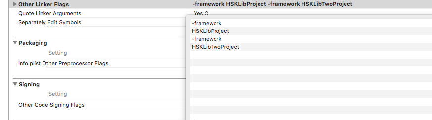

11. 这时候再试着改动 Lib 中的代码, 编译 Shell 会实时的反应在 Shell 中, 不用再手动编译
12. 回过头看, 我此时的代码目录结构跟 cocoapods 帮我们建立的结构一模一样, 至此我们可以说完整的模拟了 cocodpods 的工作, 总结一下, 建立一个 Pod 的空 .framework 当作编译式的 "flag", 让 Shell 在运行时知道去编译 Lib 中的代码, Pod 中又指定了依赖关系, 所以在编译 Lib 时, 会先编译 One 和 Two 中的代码, 最后在 <strong> Other Link Flags </strong> 中添加参数, 把 One 和 Two 链接进 Shell, 使得 Shell 可以调用 One 和 Two 中的代码 

## 工业革命

经历过磨炼, 才知道生命的可贵, 了解了手动的种种不便, 才体会到 cocoapods 带来的巨大进步. 接下来我们尝试使用 cocoapods 来自动化集成, 最后我们可以做到将成熟的模块以 .framework 的形式方便的集成到工程里

### RoundFour 私有 pod
1. podspec 文件, pod spec 文件是对库文件的抽象, 其中描述我们的库所需要的依赖, 已经源码所在目录等等, 我们看一下 cocoapod 官网里提供的示例代码
```ruby
Pod::Spec.new do |spec|
# 包名
  spec.name         = 'Reachability'
# 版本
  spec.version      = '3.1.0'
# 遵守的协议
  spec.license      = { :type => 'BSD' }
# 主页
  spec.homepage     = 'https://github.com/tonymillion/Reachability'
# 作者
  spec.authors      = { 'Tony Million' => 'tonymillion@gmail.com' }
# 概括
  spec.summary      = 'ARC and GCD Compatible Reachability Class for iOS and OS X.'
# 源码地址
  spec.source       = { :git => 'https://github.com/tonymillion/Reachability.git', :tag => 'v3.1.0' }
# 打包后的名字?
  spec.module_name  = 'Rich'
# 最低版本要求
  spec.ios.deployment_target  = '9.0'
  spec.osx.deployment_target  = '10.10'
# 源文件所在目录
  spec.source_files       = 'Reachability/common/*.swift'
  spec.ios.source_files   = 'Reachability/ios/*.swift', 'Reachability/extensions/*.swift'
  spec.osx.source_files   = 'Reachability/osx/*.swift'
# 依赖系统的framework
  spec.framework      = 'SystemConfiguration'
  spec.ios.framework  = 'UIKit'
  spec.osx.framework  = 'AppKit'
# 依赖三方的 framework
  spec.dependency 'SomeOtherPod'
end
```
2. 我们自己来尝试做一个私有pod, 需要一个 git 仓库, 我在最大的同性交友网站 基hub 申请了一个, 名字叫HSKPod, clone 到本地

3. 在 HSKPod 中建立一个工程结构, 并在根目录下建立一个 podspec 文件, 如图所示
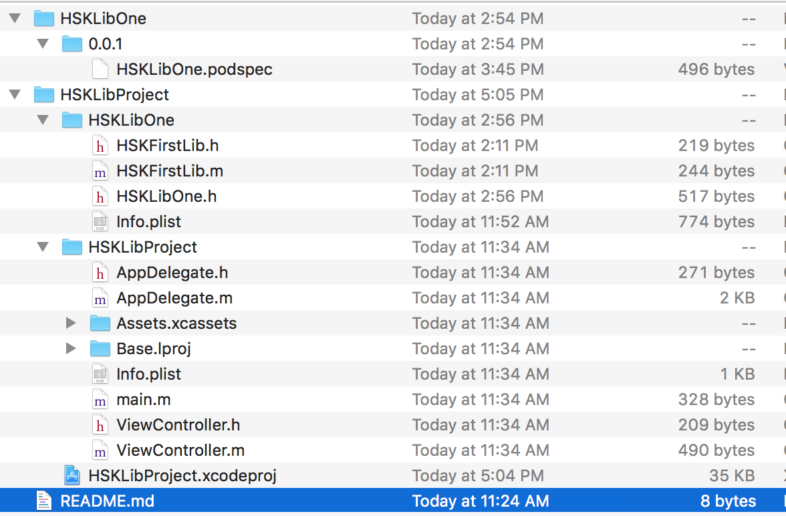

4. podpsec 文件中只是做了最基本的设置
```ruby

Pod::Spec.new do |s|

  s.name         = "HSKLibOne"
  s.version      = "0.0.1"
  s.summary      = "A short description of HSKLibOne."

  s.author       = { "leigaopan" => "leigaopan@youyuwo.com" }
  s.platform     = :ios, "8.0"
  s.source       = { :git => "http://EXAMPLE/HSKLibOne.git", :tag => "#{s.version}" }

  s.source_files = "HSKLibOne", "HSKLibOne/**/*.{h,m}"
  s.public_header_files = "HSKLibOne/HSKLibOne.h", "HSKLibOne/HSKFirstLib.h"
end
```

5. 接下来我们就要引用这个 pod 啦, 新建一个 HSKShellProject 项目, 创建 Podfile 文件, Podfile 内容如下
``` ruby
source 'https://github.com/CocoaPods/Specs.git'
source 'https://github.com/Luyakus/HSKPod.git'
use_frameworks!

platform :ios, '8.0'
target 'HSKShellProject' do
  pod 'HSKLibOne', '0.0.1'
end

```
6. 执行 pod install, 可以看到 HSKLibOne 成功的被引入了
7. 通过建立私有 pod 仓库使得我们可以方便的引用成熟模块, 并且不会泄漏公司代码

### RoundFive 惠刷卡小组的最佳实践

1. 惠刷卡小组经过实践之后, 对于使用模块化的最佳实践大致有两个方面: 提前打包成 Framework, 隐藏实现细节; 编写命令行脚本, 提高工作效率
2. 提前打包成 Framework, 指的是先把代码打包成Framework, 然后以附加包的形式发布, 我们看一下其中一个模块的 podspec 文件
```ruby
Pod::Spec.new do |s|
  s.name             = 'CardApply'
  s.version          = '1.0.6'
  s.summary          = '惠刷卡信用卡申请模块.'

  s.homepage         = 'http://gitlab.gs.9188.com/caiyi.financial.huishuaka.app/CreditCardIOS'
  s.license          = { :type => 'MIT', :file => 'LICENSE' }
  s.author           = { 'wanghuiyang' => 'wanghuiyang@9188.com' }
  s.source           = { :git => 'http://gitlab.gs.9188.com/caiyi.financial.huishuaka.app/hskspec.git', :tag => '2.2.6' }

  s.ios.deployment_target = '8.0'

  # 这里就是提前打包好的 framework, 此处路径是以 git 的根目录为基准
  s.vendored_frameworks = 'Frameworks/CardApply/CardApply.framework'

  s.dependency 'HSKBasic'
end

```
引入的效果如图
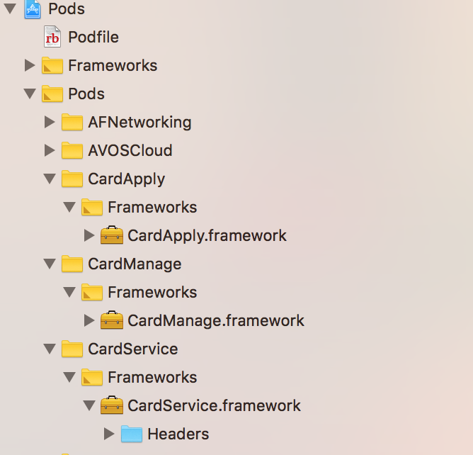
可以看到, 源码完全被隐藏了, 只能看到头文件, 同时简化了 podspec 文件

2. 编写脚本自动化打包Framework, 提高工作效率, 由于需要同时打包模拟器和真机的包, 手动打包合并肯定麻烦的很, 而且容易出错, 编写脚本可以解决这样的问题, 代码如下
```python


import os
import re
import shutil
import subprocess
import argparse
import plistlib

SPEC_PATH = '/Users/9188-mac005/Documents/Work/hskspec/Frameworks'

# 各项目本地目录
HSKBASIC_PATH = '/Users/9188-mac005/Documents/Work/HSKBasic'
CARDMANAGE_PATH = '/Users/9188-mac005/Documents/Work/CreditCard'
CARDAPPLY_PATH = '/Users/9188-mac005/Documents/Work/CreditCard'
CARDSERVICE_PATH = '/Users/9188-mac005/Documents/Work/CreditCard'
LOAN_PATH = '/Users/9188-mac005/Documents/Work/Loan'
HOUSEMMOUDLE_PATH = '/Users/9188-mac005/Documents/Work/YYHouseIOS'
HOUSETOOL_PATH = '/Users/9188-mac005/Documents/Work/YYHouseIOS'
CREDITQUARY_PATH = '/Users/9188-mac005/Documents/Work/YYCreditIOS'
YYBBSMODULE_PATH = '/Users/9188-mac005/Documents/Work/YYFinanceIOS'

# 私有仓库地址
POD_SOURCES = 'http://gitlab.gs.9188.com/caiyi.financial.huishuaka.app/hskspec.git,https://github.com/CocoaPods/Specs'


class PathError(IOError):
    pass


class CmdError(Exception):
    pass

ValueError
class Git(object):
    def __init__(self, git_path):
        if os.path.exists(git_path):
            self.path = git_path
        else:
            raise PathError('git path: %s is not exists' % git_path)

    def execmd(self, cmd):
        os.chdir(self.path)

        process = subprocess.Popen(cmd, stdout=subprocess.PIPE, shell=True)
        (stdoutdata, stderrdata) = process.communicate()

        if stderrdata:
            raise CmdError(stderrdata.decode('utf-8').strip())
        return stdoutdata.decode('utf-8').strip()

    def add(self, file_path = '.'):
        self.execmd('git add %s' % file_path)

    def commit(self, desc = 'commit'):
        self.execmd('git commit -m %s' % desc)

    def pull(self):
        self.execmd('git pull')

    def push(self):
        self.execmd('git push')

    def tag(self, tag_number = None):
        if tag_number is None:
            tag_number = self.create_new_tag()

        self.execmd('git tag %s' % tag_number)
        self.execmd('git push origin --tags')
        print('>>>>> create new tag : %s <<<<<' % tag_number)

    def get_latest_tag(self):
        tags = self.execmd('git tag')
        if tags:
            return tags.split('\n')[-1]
        return None

    def create_new_tag(self):
        old_tag = self.get_latest_tag()
        tagnum = int(old_tag.replace('.', ''))
        tagnum += 1
        l = list('%s' % tagnum)
        new_tag = '.'.join(l)
        return new_tag


class Spec(Git):
    def __init__(self, sepc_path):
        super(Spec, self).__init__(sepc_path)

    def pod_push(self, moudle_name):
        podspec_path = os.path.join(self.path, '%s/%s.podspec' % (moudle_name, moudle_name))
        cmd = 'pod repo push hskspec %s --allow-warnings --sources=%s' % (podspec_path, POD_SOURCES)
        print('>>>>> run %s <<<<<' % cmd)
        self.execmd(cmd)
        print('>>>>> push %s success <<<<<' % moudle_name)

    def copy_framework_to_spec(self, moudle_name, src):
        framework_path = os.path.join(self.path, '%s/%s.framework' % (moudle_name, moudle_name))
        if os.path.exists(framework_path):
            shutil.rmtree(framework_path)
        shutil.copytree(src, framework_path)
        print('>>>>> copy %s.framework to %s' % (moudle_name, self.path))

    def update_spec_file(self, moudle_name, moudle_version):
        tag_number = self.create_new_tag()
        podspec_path = os.path.join(self.path, '%s/%s.podspec' % (moudle_name, moudle_name))

        with open(podspec_path, 'r') as rfp:
            lines = rfp.readlines()

        with open(podspec_path, 'w') as wfp:
            for line_num, line in enumerate(lines):
                if re.match(r'\s*s.version\s*=\s*', line):
                    line = re.sub(r'\d.\d.\d', moudle_version, line)
                    lines[line_num] = line
                    print('>>>>> %s <<<<<' % line)

                if re.match(r'\s*s.source\s*=\s*', line):
                    line = re.sub(r'\d.\d.\d', tag_number, line)
                    lines[line_num] = line
                    print('>>>>> %s <<<<<' % line.strip())

            wfp.writelines(lines)


class Module(Git):
    def __init__(self, moudle_name, moudle_path):
        super(Module, self).__init__(moudle_path)
        self.new_version = ''
        self.name = moudle_name
        self.common_sdk_path = '%s/DerivedData/Build/Products/Common-SDK/%s.framework' % (self.path, self.name)
        self.iphoneos_sdk_path = '%s/DerivedData/Build/Products/Release-iphoneos/%s.framework' % (self.path, self.name)
        self.iphonesimulator_sdk_path = '%s/DerivedData/Build/Products/Release-iphonesimulator/%s.framework' % (self.path, self.name)

    def build(self):
        print('>>>>> start build %s.framework <<<<<' % self.name)

        self.increase_framework_version()

        workspace = [x for x in os.listdir(self.path) if os.path.splitext(x)[1] == '.xcworkspace'][0]

        print('>>>>> building %s.framework <<<<<' % self.name)
        try:
            self.execmd("xcodebuild -workspace %s -scheme %s -configuration Release -destination generic/platform=iOS -destination 'platform=iOS Simulator,name=iPhone 6' clean build" % (workspace, self.name))
        except:
            print('>>>>> build %s.framework failed <<<<<' % self.name)
            exit(0)

        print('>>>>> build %s.framework success <<<<<' % self.name)

        if os.path.exists(self.common_sdk_path):
            shutil.rmtree(self.common_sdk_path)
        shutil.copytree(self.iphoneos_sdk_path, self.common_sdk_path)
        
        self.execmd('lipo -create %s/%s %s/%s -output %s/%s' % (self.iphoneos_sdk_path, self.name, self.iphonesimulator_sdk_path, self.name, self.common_sdk_path , self.name))
        print('>>>>> merge %s.framework to %s <<<<<' % (self.name, self.common_sdk_path))

    def increase_framework_version(self):

        info_plist_path = '%s/Modules/%s/Info.plist' % (self.path, self.name)
        if not os.path.exists(info_plist_path):
            info_plist_path = '%s/%s/Info.plist' % (self.path, self.name)

        with open(info_plist_path, 'rb+') as fp:
            info = plistlib.loads(fp.read())
            old_version = info['CFBundleShortVersionString']
            old_version_num = int(old_version.replace('.', ''))
            new_version = '.'.join(list('%s' % (old_version_num + 1)))
            info['CFBundleShortVersionString'] = new_version
            fp.seek(0)
            plistlib.dump(info, fp)
            self.new_version = new_version
            print('>>>>> increase %s.framework version to %s <<<<<' % (self.name, new_version))


def build(moudle_name, source_path, spec):

    moudle = Module(moudle_name, source_path)
    moudle.build()

    spec.copy_framework_to_spec(moudle_name, moudle.common_sdk_path)
    spec.update_spec_file(moudle_name, moudle.new_version)


def main():
    
    parser = argparse.ArgumentParser()

    # 缩写对应
    arg_dict = {'-hb': '--hsk_basic',
                '-cm': '--card_manage',
                '-ca': '--card_apply',
                '-cs': '--card_service',
                '-ln': '--loan',
                '-ht': '--house_tool',
                '-hm': '--house_moudle',
                '-cq': '--credit_quary',
                '-bbs': '--finance_bbs'}
    # 获取附加参数
    for key, value in arg_dict.items():
        parser.add_argument(key, value, action='store_true')

    args = parser.parse_args()

    # 更新并上传 podspec 文件的工具类
    spec = Spec(SPEC_PATH)

    moudles = []
    # 编译 framework, 并记录
    if args.hsk_basic:
        moudles_name = 'HSKBasic'
        build(moudles_name, HSKBASIC_PATH, spec)
        moudles.append(moudles_name)

    if args.card_manage:
        moudles_name = 'CardManage'
        build(moudles_name, CARDMANAGE_PATH, spec)
        moudles.append(moudles_name)

    if args.card_apply:
        moudles_name = 'CardApply'
        build(moudles_name, CARDAPPLY_PATH, spec)
        moudles.append(moudles_name)

    if args.card_service:
        moudles_name = 'CardService'
        build(moudles_name, CARDSERVICE_PATH, spec)
        moudles.append(moudles_name)

    if args.loan:
        moudles_name = 'LoanModule'
        build(moudles_name, LOAN_PATH, spec)
        moudles.append(moudles_name)

    if args.house_tool:
        moudles_name = 'HouseTool'
        build(moudles_name, HOUSETOOL_PATH, spec)
        moudles.append(moudles_name)

    if args.house_moudle:
        moudles_name = 'HouseModule'
        build(moudles_name, HOUSEMMOUDLE_PATH, spec)
        moudles.append(moudles_name)

    if args.credit_quary:
        moudles_name = 'CreditenQuiryModule'
        build(moudles_name, CREDITQUARY_PATH, spec)
        moudles.append(moudles_name)

    if args.finance_bbs:
        moudles_name = 'YYBBSModule'
        build(moudles_name, YYBBSMODULE_PATH, spec)
        moudles.append(moudles_name)

    # 把打包好的 framework 推送到 git
    spec.add() # git add
    spec.commit() # git commit
    spec.pull() # git pull
    spec.push() # git push
    spec.tag() # 打tag

    for moudle in moudles:
        # 更新 podspec 文件, 并上传
        spec.pod_push(moudle)

# 如果被当做执行文件运行, 则运行 main()
if __name__ == '__main__':
    main()
```